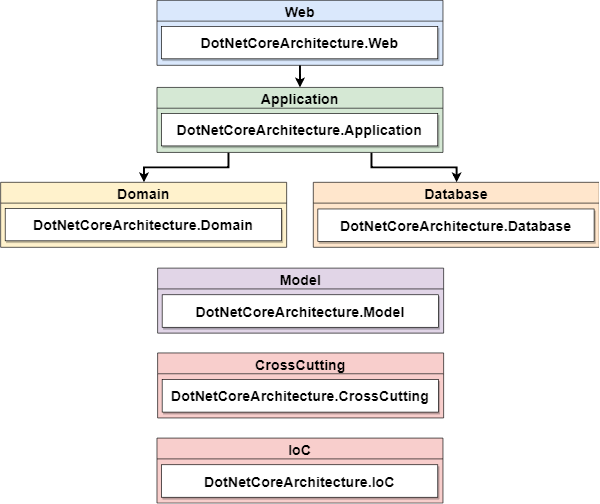
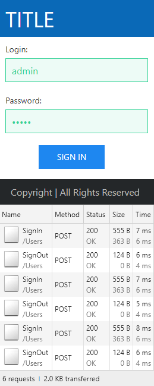
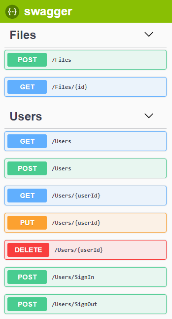

# DotNetCoreArchitecture

Architecture with new technologies and best practices.

It is not the definitive solution for all cenarios.

It is an example to learn and apply in new projects.

## Code Analysis

[](https://www.codacy.com/app/rafaelfgx/DotNetCoreArchitecture?utm_source=github.com&amp;utm_medium=referral&amp;utm_content=rafaelfgx/DotNetCoreArchitecture&amp;utm_campaign=Badge_Grade)

## Technologies

* [.NET Core 2.2.1](https://dotnet.microsoft.com/download)
* [ASP.NET Core 2.2.1](https://docs.microsoft.com/en-us/aspnet/core)
* [Entity Framework Core 2.2.2](https://docs.microsoft.com/en-us/ef/core)
* [C# 7.3](https://docs.microsoft.com/en-us/dotnet/csharp)
* [Angular 7.2.5](https://angular.io/docs)
* [Typescript 3.2.4](https://www.typescriptlang.org/docs/home.html)
* [HTML](https://www.w3schools.com/html)
* [CSS](https://www.w3schools.com/css)
* [SASS](https://sass-lang.com)
* [UIkit](https://getuikit.com/docs/introduction)
* [JWT](https://jwt.io)
* [Swagger](https://swagger.io)
* [Docker](https://docs.docker.com)

## Practices

* Clean Code
* Code Analysis
* DDD (Domain-Driven Design)
* SOLID Principles
* Dependency Injection
* Logging
* Object Mapping
* Response Compression
* Response Caching

## Tools

* [Visual Studio 2017](https://visualstudio.microsoft.com/vs)
* [Visual Studio Code](https://code.visualstudio.com)
* [SQL Server 2017](https://www.microsoft.com/en-us/sql-server/sql-server-downloads)
* [Postman](https://www.getpostman.com)
* [draw.io](https://www.draw.io)

## Visual Studio Extensions

* [CodeMaid](https://marketplace.visualstudio.com/items?itemName=SteveCadwallader.CodeMaid)
* [Roslynator](https://marketplace.visualstudio.com/items?itemName=josefpihrt.Roslynator2017)
* [SonarLint](https://marketplace.visualstudio.com/items?itemName=SonarSource.SonarLintforVisualStudio2017)
* [TSLint](https://marketplace.visualstudio.com/items?itemName=vladeck.TSLint)

## Visual Studio Code Extensions

* [Angular Language Service](https://marketplace.visualstudio.com/items?itemName=Angular.ng-template)
* [Angular v7 Snippets](https://marketplace.visualstudio.com/items?itemName=johnpapa.Angular2)
* [Atom One Dark Theme](https://marketplace.visualstudio.com/items?itemName=akamud.vscode-theme-onedark)
* [Bracket Pair Colorizer](https://marketplace.visualstudio.com/items?itemName=CoenraadS.bracket-pair-colorizer)
* [C#](https://marketplace.visualstudio.com/items?itemName=ms-vscode.csharp)
* [Debugger for Chrome](https://marketplace.visualstudio.com/items?itemName=msjsdiag.debugger-for-chrome)
* [Material Icon Theme](https://marketplace.visualstudio.com/items?itemName=PKief.material-icon-theme)
* [Sort lines](https://marketplace.visualstudio.com/items?itemName=Tyriar.sort-lines)
* [TSLint](https://marketplace.visualstudio.com/items?itemName=ms-vscode.vscode-typescript-tslint-plugin)
* [Visual Studio Keymap](https://marketplace.visualstudio.com/items?itemName=ms-vscode.vs-keybindings)
* [vscode-angular-html](https://marketplace.visualstudio.com/items?itemName=ghaschel.vscode-angular-html)

## Recommended Books

* **Clean Code: A Handbook of Agile Software Craftsmanship** - Robert C. Martin (Uncle Bob)
* **Clean Architecture: A Craftsman's Guide to Software Structure and Design** - Robert C. Martin (Uncle Bob)
* **Domain-Driven Design: Tackling Complexity in the Heart of Software** - Eric Evans
* **Domain-Driven Design Reference: Definitions and Pattern Summaries** - Eric Evans
* **Implementing Domain-Driven Design** - Vaughn Vernon
* **Domain-Driven Design Distilled** - Vaughn Vernon

## Layers and Projects



**Web:** This layer contains the api (ASP.NET Core) and the frontend (Angular).

**Application:** This layer is responsible for flow control. It does not contain business rules.

**Domain:** This layer contains the business rules and the domain logic.

**Database:** This layer isolates and abstracts the data persistence.

**Model:** This layer is responsible for modeling objects such as entities, models and enums.

**CrossCutting:** This layer provides generic features for other layers.

**IoC:** This layer provides inversion of control registering services.

## Nuget Packages

In order for this project to be as clean as possible of common functionality to many projects, Nuget packages were created for this purpose.

**Source:** [https://github.com/rafaelfgx/DotNetCore](https://github.com/rafaelfgx/DotNetCore)

**Published:** [https://www.nuget.org/profiles/rafaelfgx](https://www.nuget.org/profiles/rafaelfgx)

## ASP.NET Core Startup

The **Startup** class is responsible for configuring the application's pipeline.

```csharp
public class Startup
{
    public Startup(IHostingEnvironment environment)
    {
        Configuration = environment.Configuration();
        Environment = environment;
    }

    private IConfiguration Configuration { get; }

    private IHostingEnvironment Environment { get; }

    public void Configure(IApplicationBuilder application)
    {
        application.UseExceptionDefault(Environment);
        application.UseCorsDefault();
        application.UseHstsDefault(Environment);
        application.UseHttpsRedirection();
        application.UseAuthentication();
        application.UseResponseCompression();
        application.UseResponseCaching();
        application.UseStaticFiles();
        application.UseMvcWithDefaultRoute();
        application.UseHealthChecks("/healthz");
        application.UseSwaggerDefault("api");
        application.UseSpaStaticFiles();
        application.UseSpaAngularServer(Environment, "Frontend", "serve");
    }

    public void ConfigureServices(IServiceCollection services)
    {
        services.AddDependencyInjection(Configuration);
        services.AddCors();
        services.AddAuthenticationDefault();
        services.AddResponseCompression();
        services.AddResponseCaching();
        services.AddMvcDefault();
        services.AddHealthChecks();
        services.AddSwaggerDefault("api");
        services.AddSpaStaticFiles("Frontend/dist");
    }
}
```

## ASP.NET Core Controller

The **Controller** class is responsible for receiving and responding to requests.

```csharp
ApiController]
[RouteController]
public class UsersController : ControllerBase
{
    public UsersController(IUserService userService)
    {
        UserService = userService;
    }

    private IUserService UserService { get; }

    [HttpPost]
    public Task<IDataResult<long>> AddAsync(AddUserModel addUserModel)
    {
        return UserService.AddAsync(addUserModel);
    }

    [HttpDelete("{userId}")]
    public Task<IResult> DeleteAsync(long userId)
    {
        return UserService.DeleteAsync(userId);
    }

    [HttpGet]
    public Task<IEnumerable<UserModel>> ListAsync()
    {
        return UserService.ListAsync();
    }

    [HttpGet("{userId}")]
    public Task<UserModel> SelectAsync(long userId)
    {
        return UserService.SelectAsync(userId);
    }

    [AllowAnonymous]
    [HttpPost("[action]")]
    public DataResult SignIn(SignInModel signInModel)
    {
        return new DataResult(UserService.SignInJwtAsync(signInModel).Result);
    }

    [HttpPost("SignOut")]
    public Task SignOutAsync()
    {
        return UserService.SignOutAsync(new SignOutModel(User.Id()));
    }

    [HttpPut("{userId}")]
    public Task<IResult> UpdateAsync(long userId, UpdateUserModel updateUserModel)
    {
        updateUserModel.UserId = userId;

        return UserService.UpdateAsync(updateUserModel);
    }
}
```

## Service

The **Service** class is responsible for flow control. It uses validator, factory, domain and repository, but does not contain business rules.

```csharp
public sealed class UserService : IUserService
{
    public UserService
    (
        IDatabaseUnitOfWork databaseUnitOfWork,
        IJsonWebToken jsonWebToken,
        IUserLogService userLogService,
        IUserRepository userRepository
    )
    {
        DatabaseUnitOfWork = databaseUnitOfWork;
        JsonWebToken = jsonWebToken;
        UserLogService = userLogService;
        UserRepository = userRepository;
    }

    private IDatabaseUnitOfWork DatabaseUnitOfWork { get; }

    private IJsonWebToken JsonWebToken { get; }

    private IUserLogService UserLogService { get; }

    private IUserRepository UserRepository { get; }

    public async Task<IDataResult<long>> AddAsync(AddUserModel addUserModel)
    {
        var validation = new AddUserModelValidator().Valid(addUserModel);

        if (!validation.Success)
        {
            return new ErrorDataResult<long>(validation.Message);
        }

        var userDomain = UserDomainFactory.Create(addUserModel);

        userDomain.Add();

        var userEntity = userDomain.Map<UserEntity>();

        await UserRepository.AddAsync(userEntity).ConfigureAwait(false);

        await DatabaseUnitOfWork.SaveChangesAsync().ConfigureAwait(false);

        return new SuccessDataResult<long>(userEntity.UserId);
    }

    public async Task<IResult> DeleteAsync(long userId)
    {
        await UserRepository.DeleteAsync(userId).ConfigureAwait(false);

        await DatabaseUnitOfWork.SaveChangesAsync().ConfigureAwait(false);

        return new SuccessResult();
    }

    public async Task<PagedList<UserModel>> ListAsync(PagedListParameters parameters)
    {
        return await UserRepository.ListAsync<UserModel>(parameters).ConfigureAwait(false);
    }

    public async Task<IEnumerable<UserModel>> ListAsync()
    {
        return await UserRepository.ListAsync<UserModel>().ConfigureAwait(false);
    }

    public async Task<UserModel> SelectAsync(long userId)
    {
        return await UserRepository.SelectAsync<UserModel>(userId).ConfigureAwait(false);
    }

    public async Task<IDataResult<SignedInModel>> SignInAsync(SignInModel signInModel)
    {
        var validation = new SignInModelValidator().Valid(signInModel);

        if (!validation.Success)
        {
            return new ErrorDataResult<SignedInModel>(validation.Message);
        }

        var userDomain = UserDomainFactory.Create(signInModel);

        userDomain.SignIn();

        signInModel = userDomain.Map<SignInModel>();

        var signedInModel = await UserRepository.SignInAsync(signInModel).ConfigureAwait(false);

        validation = new SignedInModelValidator().Valid(signedInModel);

        if (!validation.Success)
        {
            return new ErrorDataResult<SignedInModel>(validation.Message);
        }

        await AddUserLogAsync(signedInModel.UserId, LogType.SignIn).ConfigureAwait(false);

        return new SuccessDataResult<SignedInModel>(signedInModel);
    }

    public async Task<IDataResult<TokenModel>> SignInJwtAsync(SignInModel signInModel)
    {
        var signedInDataResult = await SignInAsync(signInModel).ConfigureAwait(false);

        if (!signedInDataResult.Success)
        {
            return new ErrorDataResult<TokenModel>(signedInDataResult.Message);
        }

        var claims = new List<Claim>();

        claims.AddSub(signedInDataResult.Data.UserId.ToString());

        claims.AddRoles(signedInDataResult.Data.Roles.ToString().Split(", "));

        var jwt = JsonWebToken.Encode(claims);

        var tokenModel = new TokenModel(jwt);

        return new SuccessDataResult<TokenModel>(tokenModel);
    }

    public async Task SignOutAsync(SignOutModel signOutModel)
    {
        await AddUserLogAsync(signOutModel.UserId, LogType.SignOut).ConfigureAwait(false);
    }

    public async Task<IResult> UpdateAsync(UpdateUserModel updateUserModel)
    {
        var validation = new UpdateUserModelValidator().Valid(updateUserModel);

        if (!validation.Success)
        {
            return new ErrorResult(validation.Message);
        }

        var userEntityDatabase = await UserRepository.SelectAsync(updateUserModel.UserId).ConfigureAwait(false);

        var userDomain = UserDomainFactory.Create(updateUserModel);

        userDomain.SetLogin(userEntityDatabase.Login);

        userDomain.SetPassword(userEntityDatabase.Password);

        var userEntity = userDomain.Map<UserEntity>();

        await UserRepository.UpdateAsync(userEntity, userEntity.UserId).ConfigureAwait(false);

        await DatabaseUnitOfWork.SaveChangesAsync().ConfigureAwait(false);

        return new SuccessResult();
    }

    private async Task AddUserLogAsync(long userId, LogType logType)
    {
        var userLogModel = new UserLogModel(userId, logType);

        await UserLogService.AddAsync(userLogModel).ConfigureAwait(false);
    }
}
```

## Domain

The **Domain** class is responsible for business rules and domain logic.

```csharp
public sealed class UserDomain
{
    public UserDomain
    (
        long userId,
        string name,
        string surname,
        string email,
        string login,
        string password,
        Roles roles
    )
    {
        UserId = userId;
        Name = name;
        Surname = surname;
        Email = email;
        Login = login;
        Password = password;
        Roles = roles;
    }

    public UserDomain(string login, string password)
    {
        Login = login;
        Password = password;
    }

    public string Email { get; private set; }

    public string Login { get; private set; }

    public string Name { get; private set; }

    public string Password { get; private set; }

    public Roles Roles { get; set; }

    public Status Status { get; set; }

    public string Surname { get; private set; }

    public long UserId { get; private set; }

    public void Add()
    {
        Roles = Roles.User;
        Status = Status.Active;
        CreateLoginPasswordHash();
    }

    public void SetLogin(string login)
    {
        Login = login;
    }

    public void SetPassword(string password)
    {
        Password = password;
    }

    public void SignIn()
    {
        CreateLoginPasswordHash();
    }

    private void CreateLoginPasswordHash()
    {
        Login = UserDomainService.CreateHash(Login);
        Password = UserDomainService.CreateHash(Password);
    }
}
```

## Domain Factory

The **Factory** class is responsible for creating an object.

```csharp
public static class UserDomainFactory
{
    public static UserDomain Create(AddUserModel addUserModel)
    {
        return new UserDomain
        (
            addUserModel.UserId,
            addUserModel.Name,
            addUserModel.Surname,
            addUserModel.Email,
            addUserModel.Login,
            addUserModel.Password,
            addUserModel.Roles
        );
    }

    public static UserDomain Create(UpdateUserModel updateUserModel)
    {
        return new UserDomain
        (
            updateUserModel.UserId,
            updateUserModel.Name,
            updateUserModel.Surname,
            updateUserModel.Email,
            null,
            null,
            updateUserModel.Roles
        );
    }

    public static UserDomain Create(SignInModel signInModel)
    {
        return new UserDomain(signInModel.Login, signInModel.Password);
    }
}
```

## Domain Service

The **Domain Service** class is responsible for encapsulating business logic that doesn't fit within the domain object.

```csharp
public static class UserDomainService
{
    public static string CreateHash(string text)
    {
        return new Hash().Create(text);
    }
}
```

## Model

The **Model** class is responsible for containing a set of data.

```csharp
public class SignedInModel
{
    public long UserId { get; set; }

    public Roles Roles { get; set; }
}
```

## Validator

The **Validator** class is responsible for validating an object with defined rules.

```csharp
public sealed class SignedInModelValidator : Validator<SignedInModel>
{
    public SignedInModelValidator()
    {
        RuleFor(x => x).NotNull();
        RuleFor(x => x.UserId).NotNull().NotEmpty().GreaterThan(0);
        RuleFor(x => x.Roles).NotNull().NotEmpty().NotEqual(Roles.None);
    }
}
```

## DbContext

The **DbContext** class is responsible for configuring and mapping the entities in the database.

```csharp
public sealed class DatabaseContext : DbContext
{
    public DatabaseContext(DbContextOptions options) : base(options) { }

    protected override void OnModelCreating(ModelBuilder modelBuilder)
    {
        modelBuilder.ApplyConfigurationsFromAssembly();
    }
}
```

## Entity

The **Entity** class is responsible for containing properties that are mapped to a database table.

```csharp
public class UserEntity
{
    public long UserId { get; set; }

    public string Name { get; set; }

    public string Surname { get; set; }

    public string Email { get; set; }

    public string Login { get; set; }

    public string Password { get; set; }

    public Roles Roles { get; set; }

    public Status Status { get; set; }

    public virtual ICollection<UserLogEntity> UsersLogs { get; set; } = new HashSet<UserLogEntity>();
}
```

## Entity Type Configuration

The **Entity Type Configuration** class is responsible for configuring and mapping the entity to a table.

```csharp
public sealed class UserEntityConfiguration : IEntityTypeConfiguration<UserEntity>
{
    public void Configure(EntityTypeBuilder<UserEntity> builder)
    {
        builder.ToTable("Users", "User");

        builder.HasKey(x => x.UserId);

        builder.HasIndex(x => x.Email).IsUnique();
        builder.HasIndex(x => x.Login).IsUnique();

        builder.Property(x => x.UserId).IsRequired().ValueGeneratedOnAdd();
        builder.Property(x => x.Name).IsRequired().HasMaxLength(100);
        builder.Property(x => x.Surname).IsRequired().HasMaxLength(200);
        builder.Property(x => x.Email).IsRequired().HasMaxLength(300);
        builder.Property(x => x.Login).IsRequired().HasMaxLength(100);
        builder.Property(x => x.Password).IsRequired().HasMaxLength(500);
        builder.Property(x => x.Roles).IsRequired();
        builder.Property(x => x.Status).IsRequired();

        builder.HasMany(x => x.UsersLogs).WithOne(x => x.User).HasForeignKey(x => x.UserId);
    }
}
```

## Repository

The **Repository** class is responsible for abstracting and isolating data persistence.

```csharp
public sealed class UserRepository : EntityFrameworkCoreRepository<UserEntity>, IUserRepository
{
    public UserRepository(DatabaseContext context) : base(context) { }

    public Task<SignedInModel> SignInAsync(SignInModel signInModel)
    {
        return FirstOrDefaultAsync<SignedInModel>
        (
            userEntity => userEntity.Login.Equals(signInModel.Login)
            && userEntity.Password.Equals(signInModel.Password)
            && userEntity.Status == Status.Active
        );
    }
}
```

## Dependency Injection

The **ServiceCollectionExtensions** class is responsible for registering and configuring services.

```csharp
public static class ServiceCollectionExtensions
{
    public static void AddDependencyInjection(this IServiceCollection services, IConfiguration configuration)
    {
        services.AddHash();
        services.AddLogger(configuration);
        services.AddJsonWebToken(Guid.NewGuid().ToString(), TimeSpan.FromHours(12));

        services.AddDbContextEnsureCreatedMigrate<DatabaseContext>(options => options
            .UseSqlServer(configuration.GetConnectionString(nameof(DatabaseContext)))
            .ConfigureWarnings(warnings => warnings.Throw(RelationalEventId.QueryClientEvaluationWarning))
        );

        services.AddClassesMatchingInterfacesFrom
        (
            typeof(IUserService).Assembly,
            typeof(IDatabaseUnitOfWork).Assembly
        );
    }
}
```

## Angular Guard

The **Guard** class is responsible for the security of the routes.

```typescript
@Injectable()
export class AppGuard implements CanActivate {
    constructor(
        private readonly router: Router,
        private readonly appTokenService: AppTokenService) { }

    canActivate() {
        if (this.appTokenService.any()) { return true; }
        this.router.navigate(["/login"]);
        return false;
    }
}
```

## Angular Error Handler

The **Error Handler** class is responsible for centralizing the management of all errors and exceptions.

```typescript
@Injectable()
export class AppErrorHandler implements ErrorHandler {
    constructor(private readonly injector: Injector) { }

    handleError(error: any) {
        if (!error.status) { return; }

        switch (error.status) {
            case 401: {
                const router = this.injector.get(Router);
                router.navigate(["/login"]);
                break;
            }
            case 422: {
                const appModalService = this.injector.get(AppModalService);
                appModalService.alert(error.error);
                break;
            }
            default: {
                console.error(error);
                break;
            }
        }
    }
}
```

## Angular HTTP Interceptor

The **Http Interceptor** class is responsible for intercepting the request and the response to perform some logic, such as adding the JWT token in the header for every request.

```typescript
@Injectable()
export class AppHttpInterceptor implements HttpInterceptor {
    constructor(private readonly appTokenService: AppTokenService) { }

    intercept(request: HttpRequest<any>, next: HttpHandler) {
        request = request.clone({
            setHeaders: { Authorization: `Bearer ${this.appTokenService.get()}` }
        });

        return next.handle(request);
    }
}
```

## Angular Service

The **Service** class is responsible for accessing api or containing logic that does not belong to a component.

```typescript
@Injectable({ providedIn: "root" })
export class AppUserService {
    constructor(private readonly http: HttpClient) { }

    add(userModel: UserModel) {
        return this.http.post(`Users`, userModel);
    }

    delete(userId: number) {
        return this.http.delete(`Users/${userId}`);
    }

    list() {
        return this.http.get(`Users`);
    }

    select(userId: number) {
        return this.http.get(`Users/${userId}`);
    }

    update(userModel: UserModel) {
        return this.http.put(`Users/${userModel.userId}`, userModel);
    }
}
```

## Angular Component

The **Component** class is responsible for being a part of the application.

```typescript
@Component({ selector: "app-login", templateUrl: "./login.component.html" })
export class AppLoginComponent {
    signInModel = new SignInModel();

    constructor(private readonly appAuthenticationService: AppAuthenticationService) { }

    ngSubmit() {
        this.appAuthenticationService.signIn(this.signInModel);
    }
}
```

## Performance



## Specifications

**Processor:** Intel Core I7 8700K Coffee Lake 8th-generation.

**Memory:** 16GB 2400Mhz DDR4.

**Storage:** Samsung Evo 960 SSD M2 250gb.

**OS:** Windows 10 Pro 64 bits.

**Web Server:** Kestrel.

**Database:** SQL Server 2017 Developer Edition.

## Swagger



## Run Command Line

1. Install latest [.NET Core SDK](https://aka.ms/dotnet-download).

2. Open directory **source\Web\Frontend** in command line and execute **npm run restore**.

3. Open directory **source\Web** in command line and execute **dotnet run**.

4. Open <https://localhost:8090>.

## Run Visual Studio Code

1. Install latest [.NET Core SDK](https://aka.ms/dotnet-download).

2. Install [C# Extension](https://marketplace.visualstudio.com/items?itemName=ms-vscode.csharp).

3. Open directory **source\Web\Frontend** in command line and execute **npm run restore**.

4. Open **source** directory in Visual Studio Code.

5. Press **F5**.

## Run Visual Studio 2017

1. Install latest [.NET Core SDK](https://aka.ms/dotnet-download).

2. Open directory **source\Web\Frontend** in command line and execute **npm run restore**.

3. Open **source\DotNetCoreArchitecture.sln** in Visual Studio.

4. Set **DotNetCoreArchitecture.Web** as startup project.

5. Press **F5**.

## Run Docker

1. Install and configure [Docker](https://www.docker.com/get-started).

2. Execute **docker-compose up --build -d --force-recreate** in root directory.

3. Open <http://localhost:8095>.
